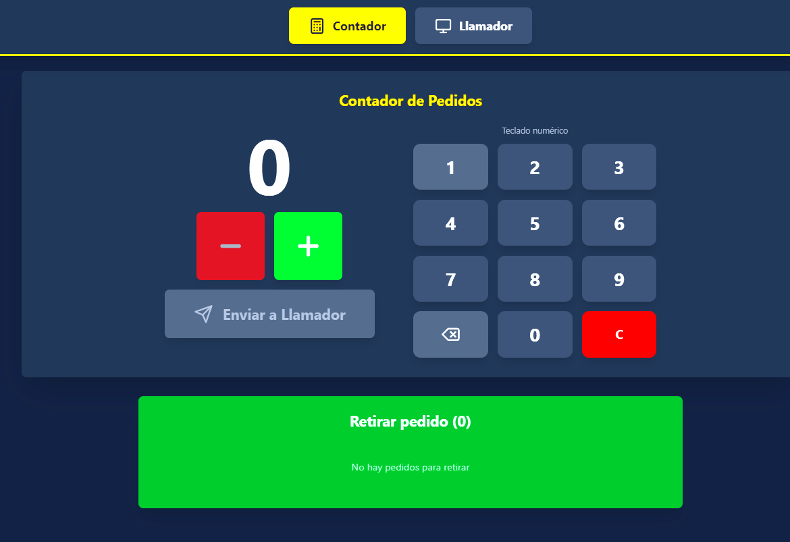

# Mi Gusto - Llamador de pedidos (Lollapalooza Order Caller)

Sistema **offline de gestión y llamado de pedidos** diseñado para los puntos de venta de **Lollapalooza Buenos Aires**, pensado para funcionar sin internet, con interfaz táctil para el contador y una vista optimizada para TV vertical en el sector de retiro.

## Demo

### Vista Contador

### Vista Llamador

## Características principales

- **100% offline**
  - Funciona completamente sin conexión a internet usando `localStorage`.
  - Los pedidos persisten incluso al recargar la página o cerrar y reabrir el navegador.

- **Dos vistas principales**
  - **Contador**:
    - Gestión de pedidos con botones táctiles grandes (+1, -1, Enviar).
    - Pensado para tablets o pantallas táctiles en el área de armado de pedidos.
  - **Llamador**:
    - Display vertical optimizado para TVs 1080x1920.
    - Enfocado en la experiencia del cliente al momento de retirar.

- **Flujo de pedidos**
  - Incrementar/decrementar el número de pedido actual.
  - Enviar pedidos a la columna **En Preparación**.
  - Mover pedidos de **En Preparación** a **A Retirar**.
  - Eliminar pedidos de cualquiera de las dos listas una vez que se completan.

- **Diseño de la vista Llamador**
  - Pantalla dividida verticalmente:
    - **En Preparación** (aprox. 60% superior – fondo naranja).
    - **A Retirar** (aprox. 40% inferior – fondo verde).
  - Los números se muestran en grillas de 3 columnas, optimizados para leerse a distancia.

## Arquitectura de la aplicación

- **Entrada múltiple con Vite**
  - `index.html`: punto de entrada genérico, que resuelve la vista según la URL (`vista=contador` o `vista=llamador`).
  - `contador.html`: entrada dedicada para la vista de contador.
  - `llamador.html`: entrada dedicada para la vista de llamador.
  - Configuradas en `vite.config.ts` usando `rollupOptions.input`.

- **Gestión de estado**
  - Estado centralizado con `useLocalStorage` para sincronizar:
    - `contadorActual`
    - Lista de pedidos **en preparación**
    - Lista de pedidos **a retirar**
  - Todas las operaciones (enviar, mover, eliminar) actualizan el estado central y se reflejan en ambas vistas.

## Tecnologías utilizadas

- **Frontend**
  - React 18
  - TypeScript
  - Vite
  - Tailwind CSS
  - Iconos de `lucide-react`

- **Almacenamiento**
  - `localStorage` para persistir números y listas de pedidos en el navegador.
  

## Desarrolladores

- **[Facu14carrizo](https://github.com/Facu14carrizo)** · [LinkedIn](https://www.linkedin.com/in/facu14carrizo/)
- **[ramirolacci](https://github.com/ramirolacci)** · [LinkedIn](https://www.linkedin.com/in/ramiro-lacci/)
